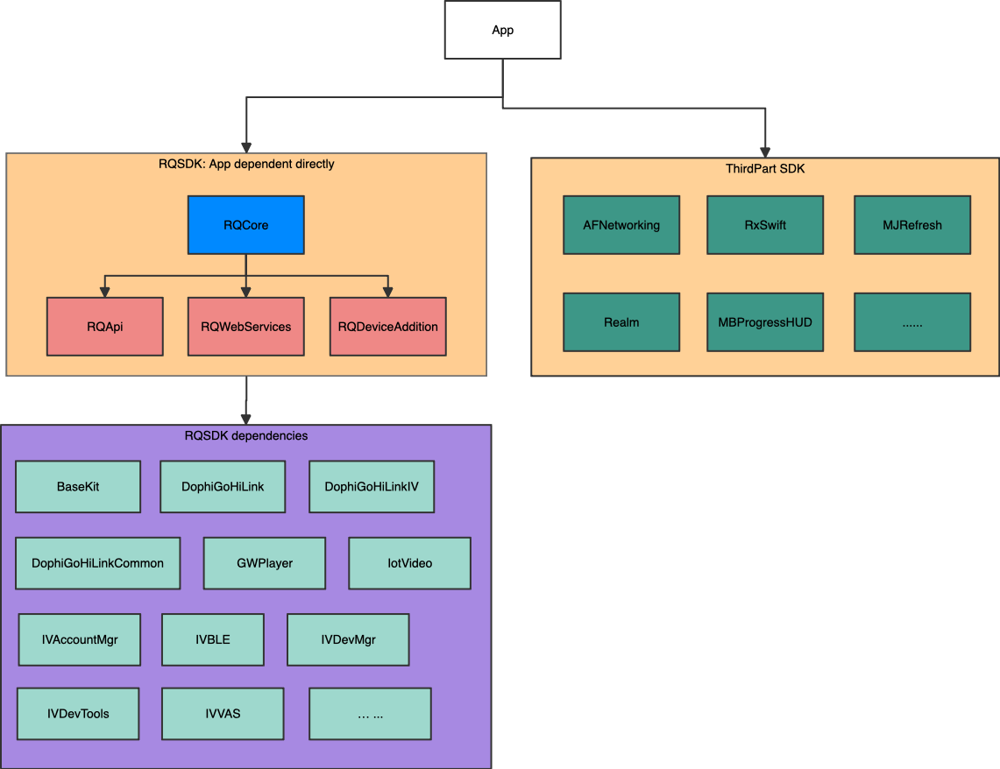
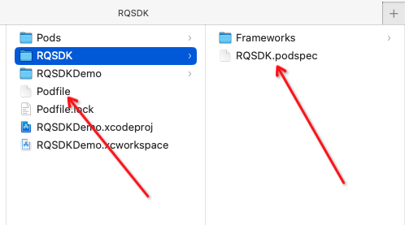
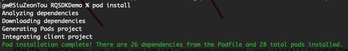
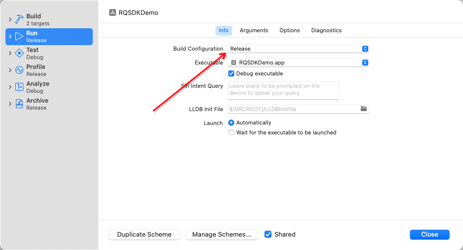

# README

## RQSDK

#### Framework架构图

See picture above:

`RQCore`, `RQApi`, `RQWebServices`, `RQDeviceAddition` is the part of`RQSDK`.

`RQCore`provider the base functions and resources support for `RQApi``RQWebServices` `RQDeviceAddition`

When using the SDK, you should use the content of the RQSDK directly, not the dependencies of the RQSDK.

### Usages

After the `RQSDKDemo.zip`unzip, you can use Cocoapods command `pod install`to install the SDK that App dependent.

## Caution

1.
    ### Now, run on release mode is not necessary.
    ~~If runing the `RQSDKDemo`on the Debug mode, the program crash is possible. Because the RQSDK frameworks is packaging by Release mode, mix the Debug and Release wolud lead the crash happend.~~

    ~~To avoid program crashes, we recommend that the `RQSDKDemo`should be run in release mode.~~

2.  
    #### For now, these frameworks only run on Xcode16.0, not Xcode15.4, not Xcode16.1, just Xcode16.0...compatibility will be improved in the future.